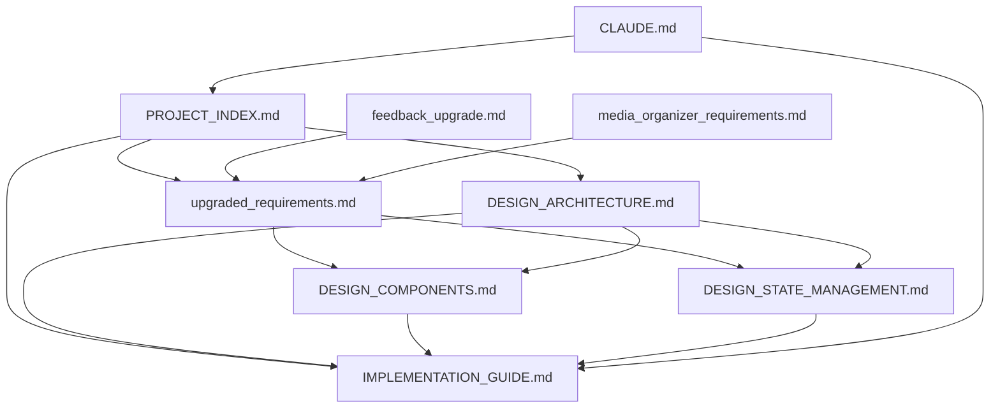

# MediaOrganizer - Project Documentation Index

## Project Overview

MediaOrganizer is a cross-platform media/file management application built with Dioxus (Rust framework), featuring a Visual Studio Code-style interface with comprehensive file preview and management capabilities.

**Current Status**: Design Phase Complete - Implementation Ready  
**Target Platforms**: Windows, macOS, Linux  
**Framework**: Dioxus (Rust-based cross-platform UI)  
**Performance Target**: Handle 10,000+ files efficiently with virtual scrolling

## 📋 Documentation Structure

### 🔵 Planning & Requirements
| Document | Purpose | Status |
|----------|---------|--------|
| [`media_organizer_requirements.md`](./media_organizer_requirements.md) | Original project requirements and specifications | ✅ Complete |
| [`upgraded_requirements.md`](./upgraded_requirements.md) | Enhanced requirements with technical improvements | ✅ Complete |
| [`feedback_upgrade.md`](./feedback_upgrade.md) | Analysis and improvement suggestions | ✅ Complete |

### 🏗️ Architecture & Design
| Document | Purpose | Status |
|----------|---------|--------|
| [`DESIGN_ARCHITECTURE.md`](./DESIGN_ARCHITECTURE.md) | System architecture and service layer design | ✅ Complete |
| [`DESIGN_COMPONENTS.md`](./DESIGN_COMPONENTS.md) | UI component interfaces and Dioxus patterns | ✅ Complete |
| [`DESIGN_STATE_MANAGEMENT.md`](./DESIGN_STATE_MANAGEMENT.md) | State management architecture and data flow | ✅ Complete |

### 🛠️ Implementation & Development
| Document | Purpose | Status |
|----------|---------|--------|
| [`IMPLEMENTATION_GUIDE.md`](./IMPLEMENTATION_GUIDE.md) | Step-by-step implementation guide with code examples | ✅ Complete |
| [`CLAUDE.md`](./CLAUDE.md) | Claude Code guidance for working with this repository | ✅ Complete |

## 🎯 Quick Navigation

### For Project Understanding
1. **Start Here**: [`PROJECT_INDEX.md`](./PROJECT_INDEX.md) (this document)
2. **Requirements**: [`upgraded_requirements.md`](./upgraded_requirements.md) - Enhanced project requirements
3. **Architecture**: [`DESIGN_ARCHITECTURE.md`](./DESIGN_ARCHITECTURE.md) - System design overview

### For Development
1. **Implementation**: [`IMPLEMENTATION_GUIDE.md`](./IMPLEMENTATION_GUIDE.md) - Detailed development guide
2. **Components**: [`DESIGN_COMPONENTS.md`](./DESIGN_COMPONENTS.md) - UI component specifications
3. **State Management**: [`DESIGN_STATE_MANAGEMENT.md`](./DESIGN_STATE_MANAGEMENT.md) - State architecture
4. **Claude Code**: [`CLAUDE.md`](./CLAUDE.md) - AI development assistant guidance

## 🔧 Core Features Overview

### User Interface
- **VS Code-Style Layout**: Resizable left panel (file tree) and right panel (content viewer)
- **Virtual Scrolling**: Efficient handling of 10,000+ files
- **Multiple View Modes**: Grid, list, and preview modes
- **Keyboard Navigation**: Comprehensive keyboard shortcuts and accessibility

### File Management
- **Cross-Platform Operations**: Copy, move, delete, rename with proper error handling
- **Batch Operations**: Multi-file selection and batch processing
- **Destination Management**: Favorite folders and custom shortcuts
- **Undo/Redo**: Operation history with rollback capability

### File Preview & Metadata
- **Image Support**: JPEG, PNG, GIF, WebP, TIFF, BMP, SVG with EXIF data
- **Video Support**: MP4, AVI, MOV, WMV, MKV, WebM with metadata extraction
- **Audio Support**: MP3, WAV, FLAC, AAC, OGG with waveform visualization
- **Document Support**: PDF, Markdown, text files with syntax highlighting
- **Thumbnail Generation**: Background processing with persistent caching

### Advanced Features
- **Search & Filter**: Real-time search with advanced filtering options
- **Duplicate Detection**: Content-based duplicate finding with progress indication
- **Background Processing**: Non-blocking operations with progress feedback
- **Caching System**: Multi-level caching for performance optimization

## 🏛️ Architecture Highlights

### Layered Architecture
```
┌─────────────────────────────────────┐
│         Presentation Layer          │  ← Dioxus Components
├─────────────────────────────────────┤
│        Business Logic Layer        │  ← Services & State Management
├─────────────────────────────────────┤
│         Data Access Layer          │  ← File System & Cache
├─────────────────────────────────────┤
│          Platform Layer            │  ← OS-Specific APIs
└─────────────────────────────────────┘
```

### Key Services
- **FileSystemService**: Cross-platform file operations with permission handling
- **PreviewService**: Multi-format preview generation (images, videos, documents)
- **CacheService**: SQLite metadata cache and file-based thumbnail cache
- **OperationsService**: File operations with undo/redo and progress tracking
- **SearchService**: Content-based search with regex and filter support

### Performance Features
- **Virtual Scrolling**: Only render visible items for large directories
- **Background Processing**: Thumbnail generation and metadata extraction
- **Smart Caching**: Persistent thumbnails and metadata with automatic cleanup
- **Memory Management**: Lazy loading and resource limits

## 📊 Development Phases

### Phase 1: Core Infrastructure (Weeks 1-2)
- Basic Dioxus application setup
- File system navigation and operations
- Simple file listing with virtual scrolling foundation

### Phase 2: UI Framework (Weeks 3-4)
- VS Code-style layout implementation
- File tree and content viewer components
- Search and filter functionality (prioritized)

### Phase 3: File Preview System (Weeks 5-6)
- Image, video, and audio preview implementations
- PDF and document viewers
- Metadata extraction and display

### Phase 4: Advanced Features (Weeks 7-8)
- Destination management and shortcuts
- Background duplicate detection
- Batch operations and comprehensive error handling

## 🔗 Key Dependencies

### Core Framework
- **dioxus**: Cross-platform UI framework
- **tokio**: Async runtime for non-blocking operations
- **walkdir**: Recursive directory traversal

### Media Processing
- **image**: Image loading and manipulation
- **ffmpeg-next**: Video metadata and thumbnails (optional)
- **rodio**: Audio playback (optional)

### Storage & Caching
- **sqlx**: SQLite database for metadata cache
- **serde**: Configuration and cache serialization

## 📈 Performance Targets

- **Startup Time**: < 3 seconds
- **Directory Loading**: < 1 second for 1,000 files, < 1 second for 10,000+ files (virtual)
- **Preview Generation**: < 500ms for common file types
- **Memory Usage**: < 200MB baseline, efficient scaling

## 🚀 Getting Started

1. **Read Requirements**: Start with [`upgraded_requirements.md`](./upgraded_requirements.md)
2. **Understand Architecture**: Review [`DESIGN_ARCHITECTURE.md`](./DESIGN_ARCHITECTURE.md)
3. **Implementation**: Follow [`IMPLEMENTATION_GUIDE.md`](./IMPLEMENTATION_GUIDE.md)
4. **Development**: Use [`CLAUDE.md`](./CLAUDE.md) for AI-assisted development

## 📝 Document Relationships



## 📋 Checklist for Contributors

### Before Starting Development
- [ ] Read project requirements in `upgraded_requirements.md`
- [ ] Understand system architecture from `DESIGN_ARCHITECTURE.md`
- [ ] Review component design patterns in `DESIGN_COMPONENTS.md`
- [ ] Study state management approach in `DESIGN_STATE_MANAGEMENT.md`

### During Development
- [ ] Follow implementation guide in `IMPLEMENTATION_GUIDE.md`
- [ ] Use `CLAUDE.md` for AI development assistance
- [ ] Maintain architectural patterns defined in design documents
- [ ] Test performance against targets specified in requirements

### For Documentation Updates
- [ ] Update relevant design documents when making architectural changes
- [ ] Maintain consistency between implementation and documentation
- [ ] Update this index when adding new documentation files

---

**Last Updated**: Design Phase Complete  
**Next Milestone**: Begin Phase 1 Implementation  
**Repository Status**: Ready for Development